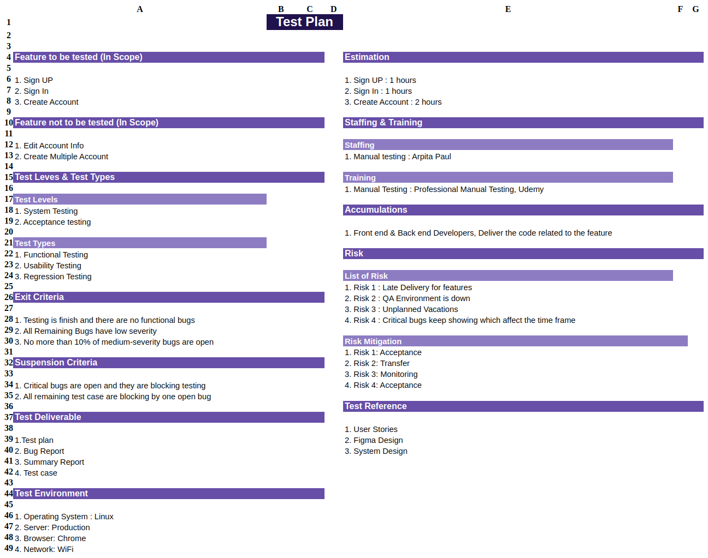
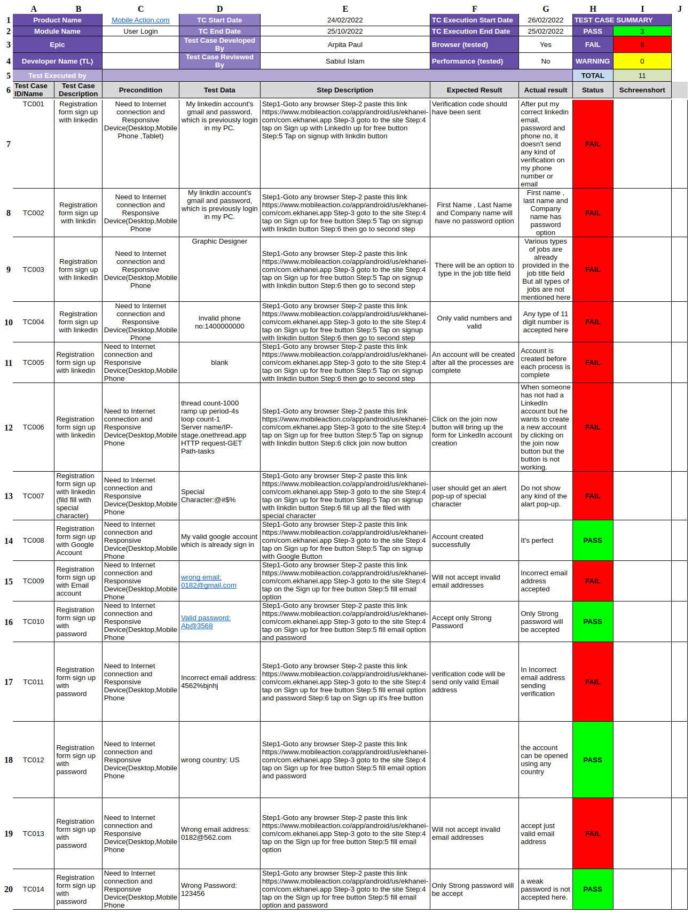
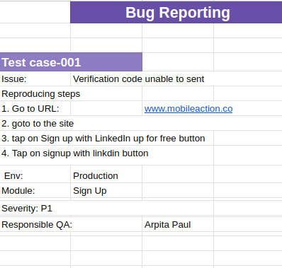

# mobileaction.co-testcases

Contains different testcases for mobileaction.co.

## Test Plan

Test plan basically describes how the testing process should be performed. The things are taken into account for the test plan of mobileaction.co system are as follows: 

- Sign up, Sign in and Create account are the three features here. But Edit account info and Create multiple account, these two features are not included.
- Different testing will be performed like system testing(functional testing, usability testing), acceptance testing (regression testing)
- The tests will be performed under different criteria 

Details is available [here](https://docs.google.com/spreadsheets/d/1tsoAWimOUNFnmOQVMQ_ujIWOxqGDi4j4GEIyqx2XiPI/edit?usp=sharing).

## Test Cases

A test case is a set of actions performed on a system to determine if it satisfies software requirements and functions correctly. Here I have included some possible test cases for mobileaction.co.

- There are varities of test case scenerio
- Some cases are passed and some are failed
- There is also a summery of the test cases at the top section
- Each test case contains a description, precondition, test data, steps, expected and actual results, a status.
- `precondition`: are the requirement to generate the test case
- `test data`: the data on which the case performed
- `step description`: basically the ordered steps by following which the case can be generated
- `expected result`: the outcomes we expect for the corresponding test case
- `actual result`: the outcomes we got for the corresponding test case
- `status`: if expected and actual results are same it is `passed`; otherwise `failed`

Details is available [here](https://docs.google.com/spreadsheets/d/1gYXUh98VLSN9TYG9hMb6sfvKYPgyfBxB7gav78QQxpo/edit?usp=sharing).

## Bug Report

A bug report in QA is a document that describes an issue or defect in a software application. It typically includes the environment, steps to reproduce the issue, and expected versus actual behavior. In this section I included the bug reports for the performed test cases previously mentioned for mobileaction.co.

- Found several bugs at the time of test cases been executed
- Each report says for which test case this bug has been reported
- Contains also reproducing steps and others info

Details is available [here](https://docs.google.com/spreadsheets/d/1YSdX1VMvFdkhMriN-yThnRkTncY4XSN4ZtF22yYx16M/edit?usp=sharing).

