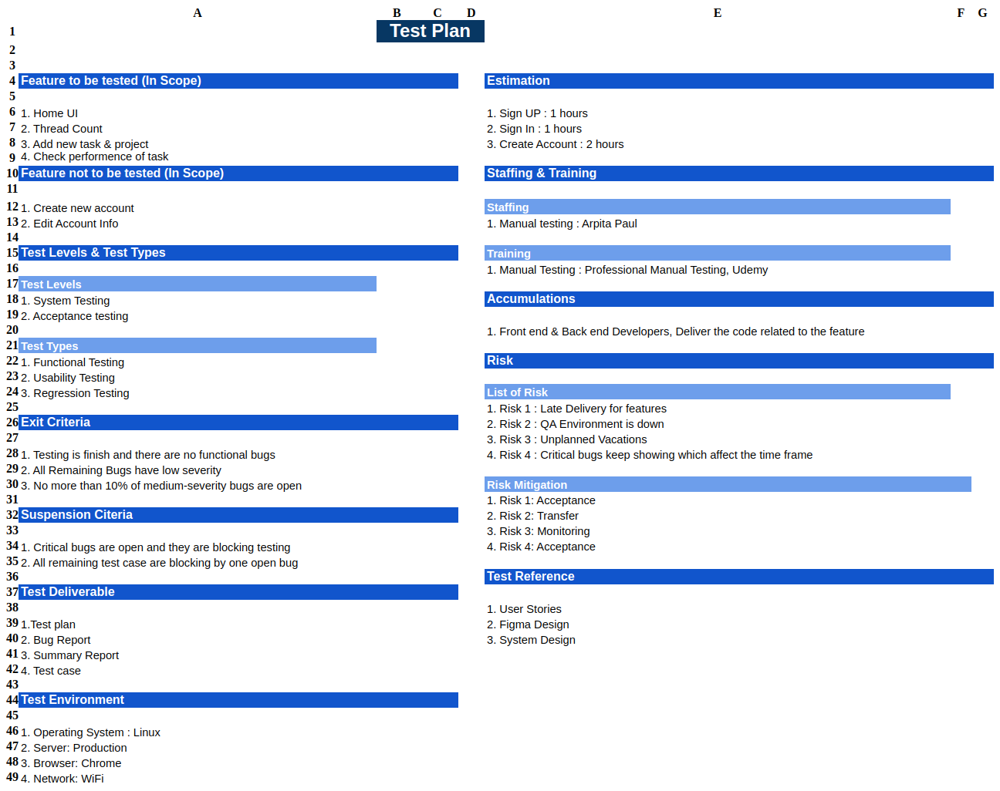
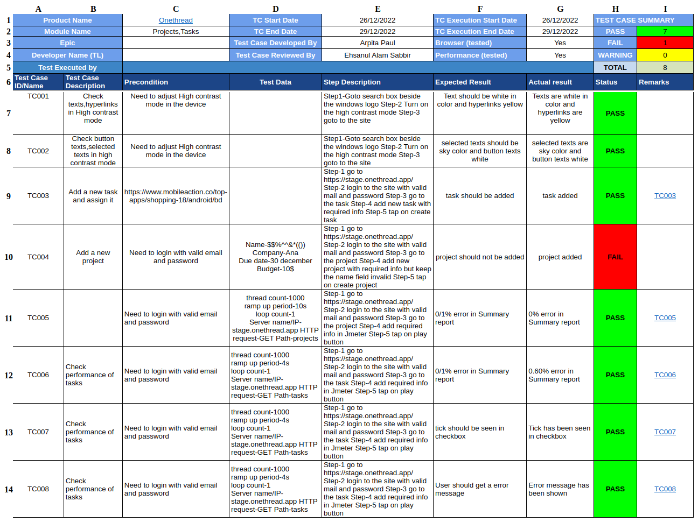
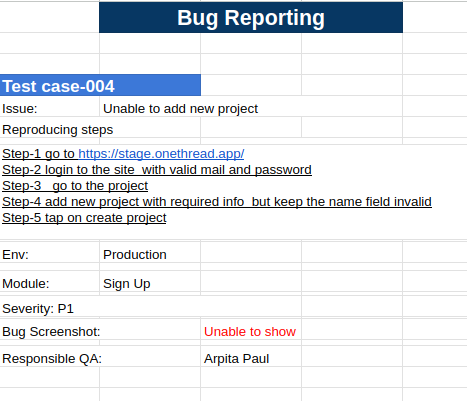

# onethread.com-testcases

Contains different testcases for pathao.com.

## Test Plan

A Test Plan is a detailed document that catalogs the test strategies, objectives, schedule, estimations, deadlines, and resources required to complete that project. Think of it as a blueprint for running the tests needed to ensure the software is working correctly. The things are taken into account for the test plan of onethread.com system are as follows: 

- Home Ui, Thread count, Add new thread and project, check performence of task are the four features tested here. But create new account and edit account info, these two features are not to be tested.
- Different testing will be performed like system testing(functional testing, usability testing), acceptance testing (regression testing)
- The tests will be performed under different criteria 

Details is available [here](https://docs.google.com/spreadsheets/d/1y2eOTXE-JFpqS1LmiLmtU0Lrkp1gBEah/edit?usp=sharing&ouid=104145674315039602633&rtpof=true&sd=true).

## Test Cases

A test case is a document, which has a set of test data, preconditions, expected results and postconditions, developed for a particular test scenario in order to verify compliance against a specific requirement. Here I have included some possible test cases for onethread.com.

- There are varities of test case scenerio
- Some cases are passed and some are failed
- There is also a summery of the test cases at the top section
- Each test case contains a description, precondition, test data, steps, expected and actual results, a status.
- `precondition`: are the requirement to generate the test case
- `test data`: the data on which the case performed
- `step description`: basically the ordered steps by following which the case can be generated
- `expected result`: the outcomes we expect for the corresponding test case
- `actual result`: the outcomes we got for the corresponding test case
- `status`: if expected and actual results are same it is `passed`; otherwise `failed`

Details is available [here](https://docs.google.com/spreadsheets/d/1vCBrq8Z9X0OwGRXDi4OwAO9XdZtD1TASxqcFVElFXs4/edit#gid=1621723119).

## Bug Report

A software bug report contains specific information about what is wrong and what needs to be fixed in software or on a website. These comprehensive reports include requests or specifics for each software issue. It lets the developers understand what is wrong and how to fix it. In this section I included the bug reports for the performed test cases previously pathao.com.

- Found several bugs at the time of test cases been executed
- Each report says for which test case this bug has been reported
- Contains also reproducing steps and others info

Details is available [here](https://docs.google.com/spreadsheets/d/1YSdX1VMvFdkhMriN-yThnRkTncY4XSN4ZtF22yYx16M/edit?usp=sharing).

