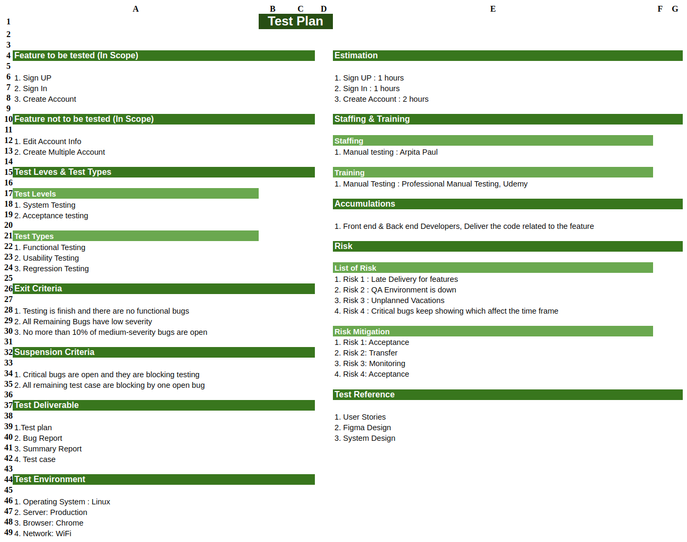
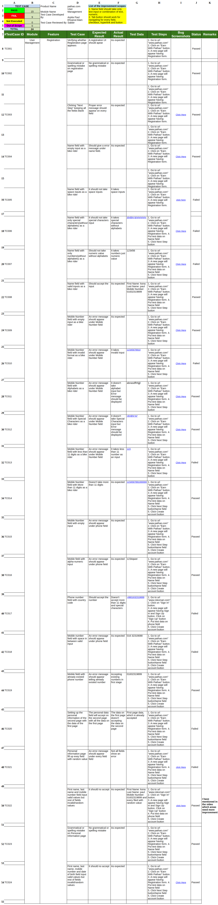
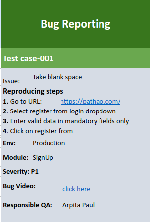

# pathao.com-testcases

Contains different testcases for onethread.

## Test Plan

A test plan is a detailed document which describes software testing areas and activities. It outlines the test strategy, objectives, test schedule, required resources, test estimation and test deliverables. The things are taken into account for the test plan of pathao.com system are as follows: 

- Sign Up, Sign In, Create account are the three features tested here. But create multiple account and edit account info, these two features are not to be tested.
- Different testing will be performed like system testing(functional testing, usability testing), acceptance testing (regression testing)
- The tests will be performed under different criteria 

Details is available [here](https://docs.google.com/spreadsheets/d/1CNG0NNkNq4H9E3tuRRgq-OKSS-IIs1i-/edit?usp=sharing&ouid=104145674315039602633&rtpof=true&sd=true).

## Test Cases

The test case is defined as a group of conditions under which a tester determines whether a software application is working as per the customer's requirements or not. Test case designing includes preconditions, case name, input conditions, and expected result. A test case is a first level action and derived from test scenarios. Here I have included some possible test cases for pathao.com.

- There are varities of test case scenerio
- Some cases are passed and some are failed
- There is also a summery of the test cases at the top section
- Each test case contains a description, precondition, test data, steps, expected and actual results, a status.
- `precondition`: are the requirement to generate the test case
- `test data`: the data on which the case performed
- `step description`: basically the ordered steps by following which the case can be generated
- `expected result`: the outcomes we expect for the corresponding test case
- `actual result`: the outcomes we got for the corresponding test case
- `status`: if expected and actual results are same it is `passed`; otherwise `failed`

Details is available [here](https://docs.google.com/spreadsheets/d/1-jbPIuMbA6TBvJsxZOpZzJhve1MiQ-2OHGFxowYikxs/edit?usp=sharing).

## Bug Report

A bug report contains device logs, stack traces, and other diagnostic information to help you find and fix bugs in your app. To capture a bug report from your device, use the Take bug report developer option on the device, the Android Emulator menu, or the adb bugreport command on your development machine. In this section I included the bug reports for the performed test cases previously pathao.com.

- Found several bugs at the time of test cases been executed
- Each report says for which test case this bug has been reported
- Contains also reproducing steps and others info

Details is available [here](https://docs.google.com/spreadsheets/d/1VHPfVS-djt2vINDgmdx7VgxiFOsQM8on_8A42lyj1K0/edit?usp=sharing).

